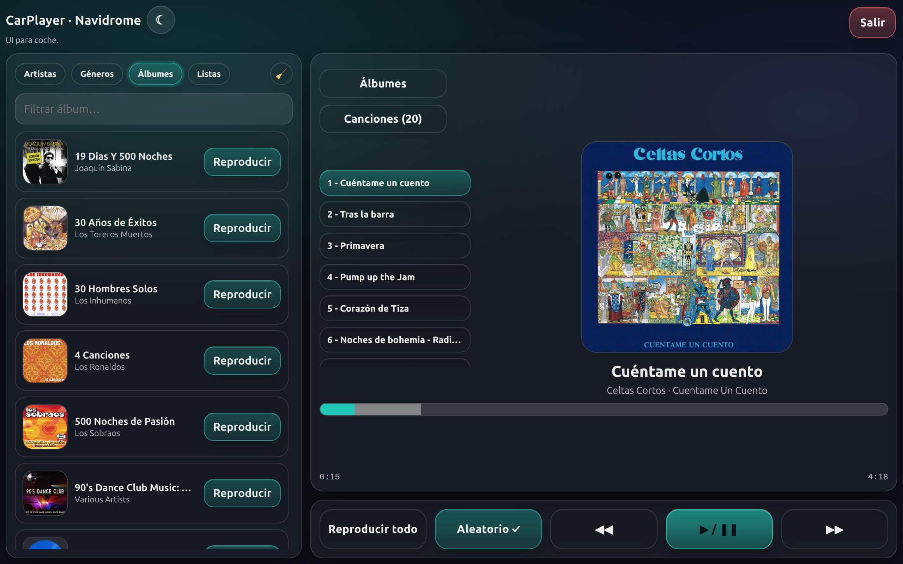

# W.I.P. 

# CarPlayer · Navidrome (UI para coche)

Quieres escuchar tu música de Navidrome en el coche con una interfaz sencilla y adaptada a pantallas para coche.

Música que has comprado y tienes guardada a buen recaudo en tu servidor Navidrome, sin depender de servicios de streaming.

## Descripción
Cliente web “car mode” (1280×480) para Navidrome usando la API compatible **Subsonic** (`/rest/...`).

Estado: **prueba / viabilidad (proof-of-concept)**. La UI y el flujo de reproducción pueden cambiar.

## Contenido

- UI: `index.html`

## Requisitos mínimos

- Un Navidrome accesible por HTTP/HTTPS.
- Servir `index.html` como estático (cualquier servidor: NAS, VPS, PC, etc.).

## ¿Hay que configurar algo en `index.html`?

No es obligatorio.

- En la pantalla de login configura el **Servidor....** , usuario y contraseña.
- El servidor se guarda en el dispositivo (localStorage) para no tener que repetirlo.
- Usa la URL base de Navidrome, por ejemplo `https://navidrome.tudominio.com` (o `https://tudominio.com/navidrome` si lo sirves bajo subruta).

## Seguridad

- En la UI se usa token Subsonic (salt+md5) para evitar enviar la contraseña como `p=...`.
- El usuario y la contraseña se guardan en el navegador del dispositivo para evitar reescribirlos.
